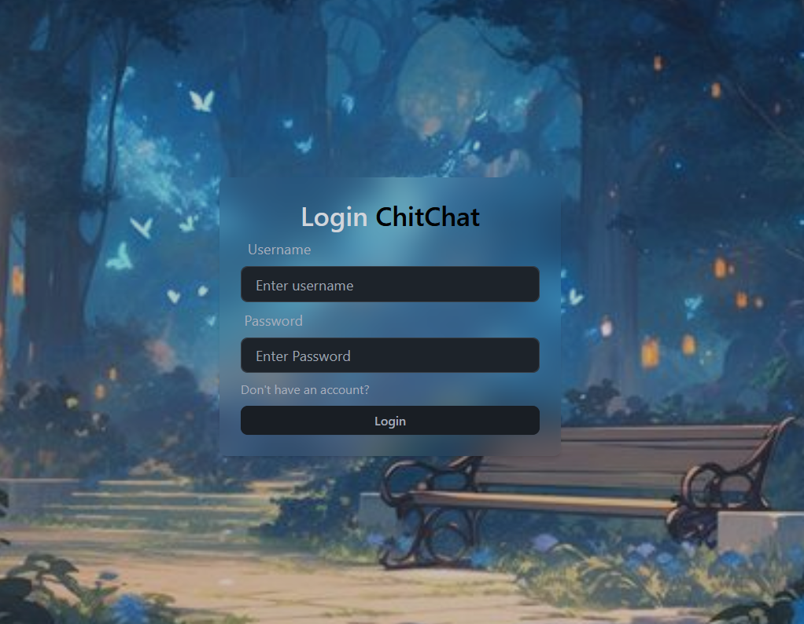
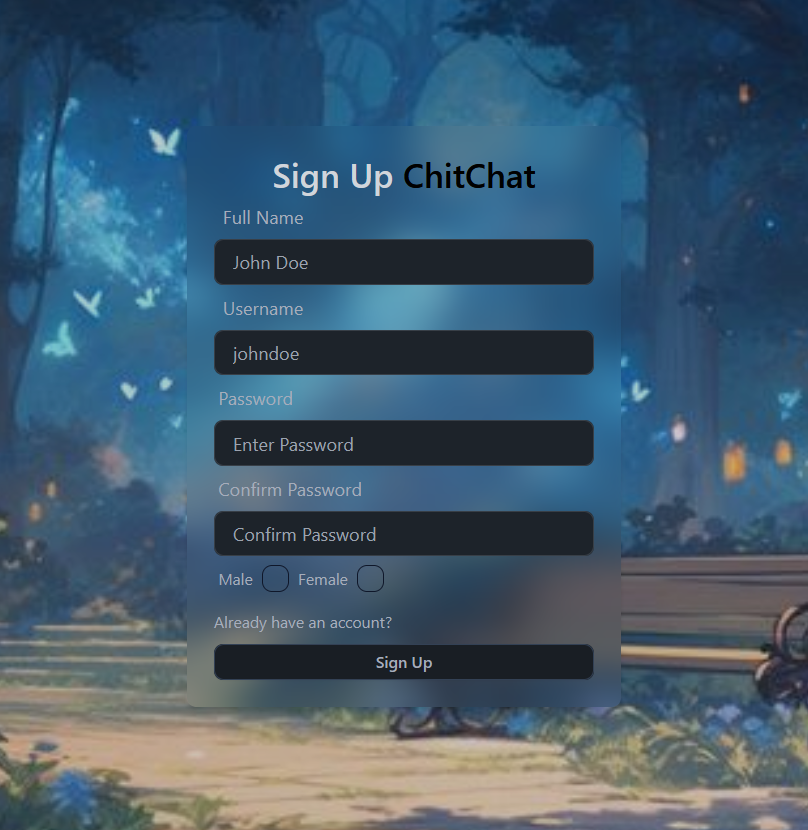
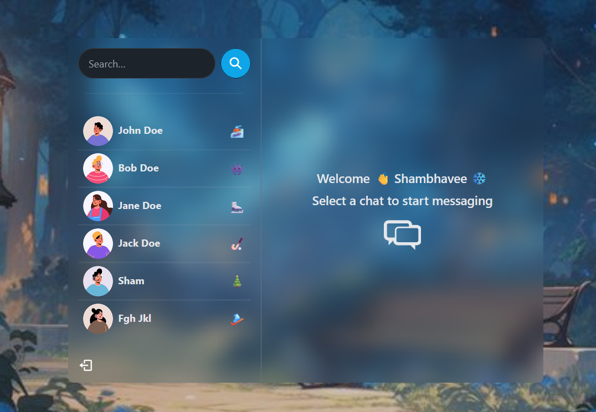
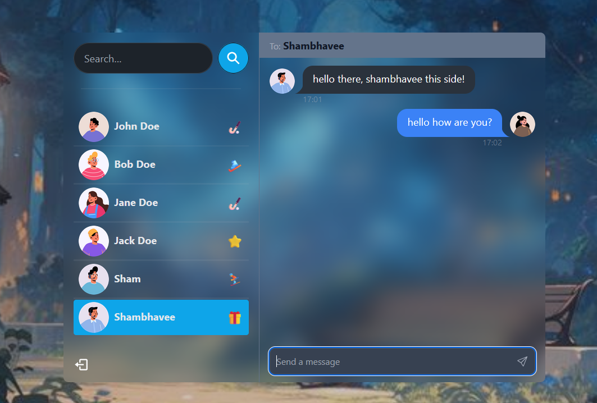

# ChittChat — Real-Time Chatting Application (MERN)

A clean, refactored README for the ChittChat project — a responsive real-time chat application built on the MERN stack (MongoDB, Express, React, Node.js) with Socket.io for realtime messaging.

---

<!-- Badges (replace with actual links if you add them) -->

[](LICENSE)
[](#)

---

## Table of Contents

* [About](#about)
* [Demo / Screenshots](#demo--screenshots)
* [Features](#features)
* [Tech Stack](#tech-stack)
* [Prerequisites](#prerequisites)
* [Quick Start](#quick-start)

  * [Environment variables](#environment-variables)
  * [Install dependencies](#install-dependencies)
  * [Run (dev)](#run-dev)
  * [Run (production)](#run-production)
* [Project Structure](#project-structure)
* [Usage](#usage)
* [Contributing](#contributing)
* [Code of Conduct](#code-of-conduct)
* [License](#license)
* [Acknowledgements](#acknowledgements)

---

## About

ChittChat is a real-time chatting application that lets users send and receive messages instantly. It demonstrates a production-capable architecture using the MERN stack and Socket.io for WebSocket-based real-time communication.

The app is intended to be:

* simple to run locally for development
* modular and easy to extend with features (e.g., file sharing, typing indicators, read receipts)
* a friendly repo for open-source contributors (Hacktoberfest 2025)

---

## Demo / Screenshots

> Replace `./screenshots/*.png` with your actual images. Keep screenshots optimized for the repo.







---

## Features

* Real-time messaging with **Socket.io**
* Persistent message storage in **MongoDB**
* User authentication (JWT)
* Responsive React frontend
* Simple REST API (Express + Node)
* Environment-friendly configuration via `.env`

---

## Tech Stack

* Frontend: React.js (Vite or Create React App)
* Backend: Node.js, Express
* Database: MongoDB (Atlas or local)
* Real-time: Socket.io
* Auth: JSON Web Tokens (JWT)

---

## Prerequisites

Make sure you have the following installed:

* Node.js v14+ (recommended: v16 or newer)
* npm (v6+) or Yarn
* MongoDB (local) or a MongoDB Atlas cluster
* Git (for cloning and contributing)

---

## Quick Start

These instructions assume the repo root contains two folders: `/backend` and `/frontend`.

### 1) Environment variables

Create a `.env` file in the `backend` folder. Example:

```env
PORT=5000
MONGO_DB_URI=your_mongodb_connection_uri
JWT_SECRET=your_jwt_secret
NODE_ENV=development
```

> Tip: For a random JWT secret you can run `openssl rand -base64 32` (or use any secure secret generator).

If you use MongoDB Atlas, create a database user, add your client IP to the Network Access list (or allow `0.0.0.0/0` temporarily while developing), and copy the connection string into `MONGO_DB_URI`.

### 2) Install dependencies

Open two terminals (or use a single terminal and run the commands sequentially):

```bash
# clone the project
git clone https://github.com/shambhaveesrivastava12/ChittChat.git
cd ChittChat

# backend
cd backend
npm install

# in a different terminal: frontend
cd ../frontend
npm install
```

### 3) Run (development)

Start backend and frontend in separate terminals.

```bash
# Terminal 1 (backend)
cd backend
npm run server

# Terminal 2 (frontend)
cd frontend
npm run dev
```

* Typical ports:

  * Backend API + Socket.io: `http://localhost:5000`
  * Frontend dev server (React): `http://localhost:3000` (or as shown by your frontend tooling)

> If you'd like to run both in a single command, consider adding a root `package.json` with `concurrently`:
>
> ```json
> "scripts": {
>   "dev": "concurrently \"npm:server\" \"npm:client\"",
>   "server": "cd backend && npm run server",
>   "client": "cd frontend && npm run dev"
> }
> ```

### 4) Run (production)

For production, build the React app and serve static files from Express or host frontend separately (Netlify, Vercel, etc.).

Example (simple):

```bash
# from frontend
npm run build
# copy build to backend public folder (or point Express to serve it)
```

---

## Project Structure (suggested)

```
ChittChat/
├─ backend/
│  ├─ controllers/
│  ├─ models/
│  ├─ routes/
│  ├─ utils/
│  ├─ index.js (or server.js)
│  └─ .env
├─ frontend/
│  ├─ src/
│  ├─ public/
│  └─ vite.config.js (or CRA files)
├─ screenshots/
├─ README.md
└─ LICENSE
```

---

## Usage

1. Register a new user via the signup page.
2. Login to receive the JWT token that authenticates socket connections and API calls.
3. Start chatting — messages are transmitted in realtime through Socket.io and stored in MongoDB.

Suggested feature additions you or contributors can implement:

* Direct messages and group rooms
* Message reactions and editing
* Typing indicators and read receipts
* Message search and pagination
* File/image attachments with virus scanning

---

## Contributing

We welcome contributions! Please follow these steps:

1. Fork the repo.
2. Create a feature branch: `git checkout -b feat/your-feature`.
3. Commit your changes: `git commit -m "feat: add ..."`.
4. Push to your branch: `git push origin feat/your-feature`.
5. Open a Pull Request describing your change.

**Hacktoberfest 2025**: We encourage helpful, well-documented PRs. Low-effort or spammy PRs will be closed.

---

## Code of Conduct

Please follow a respectful and constructive code of conduct. Be kind and open to feedback.

---

## License

This project is licensed under the **MIT License** — see the `LICENSE` file for details.

---

## Acknowledgements

* Project inspiration: burakorkmez and other open-source chat projects.
* Libraries: Socket.io, Mongoose, Express, React.
---


